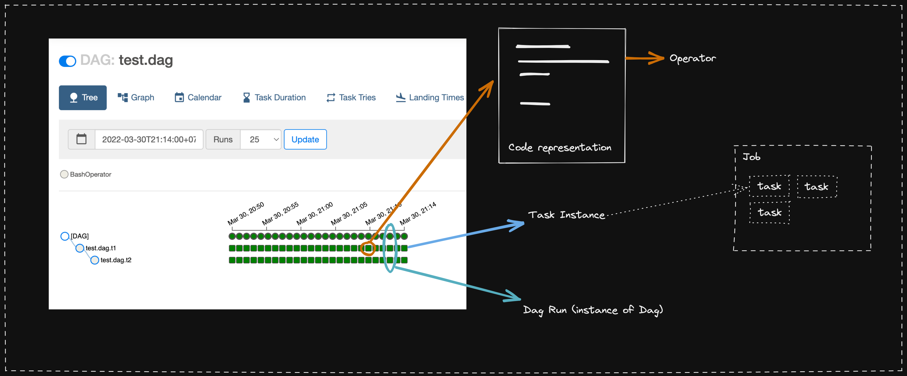

# DAG Basic
- [DAG Basic](#dag-basic)
  - [Definitions](#definitions)
  - [Create DAG](#create-dag)
  - [Deploying DAG](#deploying-dag)

## Definitions
- DAG: Direct Acyclic Graph. Airflow jobs representation / declaration. Just  a config, not the actual data processing.
- Operator: Code block (conceptual) representation of the task
- Task: (task_instance) An instance created when task is triggered. Task -> single unit execution in DAGs
- Job: Representation of collection of tasks. Holds information related to the executor/worker of bunch of task
- Run: (dag_run) Contains information (state etc) of the dag instance

---

## Create DAG
- Use `airflow.DAG`
- Task can be represented as [operators](https://airflow.apache.org/docs/apache-airflow/2.2.3/concepts/operators.html)

## Deploying DAG
- airflow automatically sync with `dags_folder` path (config)
